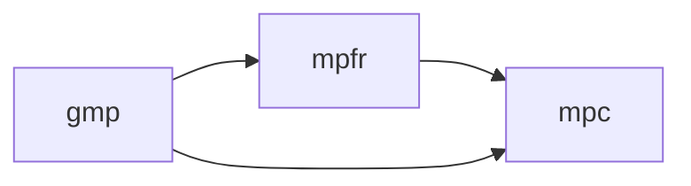

# `GCC4.4.0`源码剖析

- ⭐️：工程实践经验
- ✔️：已完成
- 配合教材：《深入分析GCC》

```txt
<font style="background:yellow">
```


## 目录

[TOC]


## ✔️A1.环境配置

### 1.1.源代码下载

- 下载源代码

```bash
[root@CentosLinux ~]# wget -c http://mirror1.babylon.network/gcc/releases/gcc-4.4.0/gcc-4.4.0.tar.bz2
--2021-11-26 10:56:01--  http://mirror1.babylon.network/gcc/releases/gcc-4.4.0/gcc-4.4.0.tar.bz2
Resolving mirror1.babylon.network (mirror1.babylon.network)... failed: Name or service not known.
wget: unable to resolve host address ‘mirror1.babylon.network’
```

- 发现不行，用下面

```bash
wget -c https://ftp.gnu.org/gnu/gcc/gcc-4.4.0/gcc-4.4.0.tar.bz2
```

- 解压缩

```bash
tar xjvf gcc-4.4.0.tar.bz2
```


### 1.2.GCC源码编译⭐️

- Linux From Scratch：http://www.jinbuguo.com/lfs/lfs62/index.html
- [GCC源码编译](https://www.cnblogs.com/alianbog/p/12498915.html)


#### 1.2.1.下载依赖

Gcc 的三大件前面已经提到过了，而它们在安装时也存在依赖关系

- mpfr 需要依赖 gmp，mpc 则是依赖 gmp 和 mpfr，因此安装的顺序是 gmp，mpfr，最后才是 mpc。
- 依赖关系参考教程：https://jcf94.com/2016/04/15/2016-04-15-gcc/



gmp（公司有类似的）

- GMP(The GNU Multiple Precision Arithmetic Library)又叫**GNU多精度算术库**，是一个提供了很多操作高精度的大整数，浮点数的运算的算术库，几乎没有什么精度方面的限制，功能丰富。我刚接触到这个东西的时候是在学习PHP的过程中。GMP的主要目标应用领域是密码学的应用和研究、 互联网安全应用、 代数系统、 计算代数研究等。
- 参考资料：https://www.cnblogs.com/ECJTUACM-873284962/p/8350320.html

mpfr

- MPFR：GNU多精度浮点舍入库
- 官网：https://www.mpfr.org/

mpc

- MPC：GNU多精度C库
- https://ftp.gnu.org/gnu/mpc/


#### 1.2.2.扩展的

- ELF：可执行和可链接格式库
- PPL：Parma Polyhedra库（PPL非必需）（可选，用于内存优化）
- isl库：（ISL非必需）：isl是一个用于多面体模型调度实现的c/c++库。通过isl，我们可以对模型进行自动的调度，循环优化等。
- expat：Expat是一个用C语言开发的、用来解析XML文档的开发库，它最初是开源的、Mozilla 项目下的一个[XML解析器](https://baike.baidu.com/item/XML解析器/2673664)。
- libiconv库：libiconv库是一个基于GNU协议的开源库，主要是解决多语言编码处理转换等应用问题由于历史原因，国际化的文字常常由于语言或者国家的原因使用不同的编码。Libiconv是一个常用的编码转换库，支持常用的多种编码之间的转换，主要函数有：
- dejagnu库：DejaGnu 是一个非常好的开源的测试工具，尤其是做 GNU 开源工具链的软件开发，更离不开 DejaGnu 的支持，因为 binutils, gcc, gdb 自带的[**测试用例**](javascript:;)都是使用 DejaGnu 进行测试的。但是，DejaGnu 也有一些不足之处。因为它是开源的，我们可以修改它来满足我们的需求。
- riscv-isa-sim：riscv-isa-sim是一个RISC-V指令的仿真器，riscv-isa-sim的正常运行需要依赖**riscv-pk**和riscv-fesvr工具。前面有对这些工具的说明。riscv-isa-sim编译后主要用到的工具是spike。其实spike不单单可以仿真RISC-V指令的，还能仿真Linux系统。


### 编译方法1.2022.gcc.11.2

```bash
whoway@ubuntu:~/gcc$ cd contrib/
whoway@ubuntu:~/gcc/contrib$ bash download_prerequisites 
error: You must run this script in the top-level GCC source directory
whoway@ubuntu:~/gcc/contrib$ cd ..
whoway@ubuntu:~/gcc$ pwd
whoway@ubuntu:~/gcc$ bash contrib/download_prerequisites 
2022-02-14 17:01:33 URL:http://gcc.gnu.org/pub/gcc/infrastructure/gmp-6.2.1.tar.bz2 [2493916/2493916] -> "gmp-6.2.1.tar.bz2" [1]
2022-02-14 17:03:25 URL:http://gcc.gnu.org/pub/gcc/infrastructure/mpfr-4.1.0.tar.bz2 [1747243/1747243] -> "mpfr-4.1.0.tar.bz2" [1]
2022-02-14 17:04:06 URL:http://gcc.gnu.org/pub/gcc/infrastructure/mpc-1.2.1.tar.gz [838731/838731] -> "mpc-1.2.1.tar.gz" [1]
2022-02-14 17:05:39 URL:http://gcc.gnu.org/pub/gcc/infrastructure/isl-0.24.tar.bz2 [2261594/2261594] -> "isl-0.24.tar.bz2" [1]
gmp-6.2.1.tar.bz2: OK
mpfr-4.1.0.tar.bz2: OK
mpc-1.2.1.tar.gz: OK
isl-0.24.tar.bz2: OK
All prerequisites downloaded successfully.

whoway@ubuntu:~/gcc$ mkdir gcc-build-2022
whoway@ubuntu:~/gcc$ cd gcc-build-2022/
whoway@ubuntu:~/gcc/gcc-build-2022$ ../gcc
gcc/            gcc-build-2022/ 
whoway@ubuntu:~/gcc/gcc-build-2022$ ../gcc
gcc/            gcc-build-2022/ 
whoway@ubuntu:~/gcc/gcc-build-2022$ ../gcc/config
config/    configure  
whoway@ubuntu:~/gcc/gcc-build-2022$ ../gcc/config
config/    configure  
whoway@ubuntu:~/gcc/gcc-build-2022$ ../gcc/configure --prefix=/usr --enable-multilib --enable-languages=c,c++ -disable-multilib


....
mkdir -p -- c-family/.deps
mkdir -p -- common/.deps
mkdir -p -- analyzer/.deps
mkdir -p -- rtl-ssa/.deps
config.status: executing default commands
```


## ✔️A2.GCC的reference链接

> gcc相关文档

- gcc的官方Wiki：[https://gcc.gnu.org/wiki/](https://gcc.gnu.org/wiki/)

- GCC online documentation（实现）：[https://gcc.gnu.org/onlinedocs/](https://gcc.gnu.org/onlinedocs/)

  - 但是没有各个版本的inter

- 源码下载ftp：[https://ftp.gnu.org/gnu/gcc/gcc-4.1.0/](https://ftp.gnu.org/gnu/gcc/gcc-4.1.0/)

- release：[https://gcc.gnu.org/releases.html](https://gcc.gnu.org/releases.html)

  - 0.5.`GCC 4.1` Release Series『发布系列』

  - Release History

    - GCC 4.1.2

      February 13, 2007 ([changes](https://gcc.gnu.org/gcc-4.1/changes.html#4.1.2))

    - GCC 4.1.1

      May 24, 2006 ([changes](https://gcc.gnu.org/gcc-4.1/changes.html))

    - GCC 4.1.0

      February 28, 2006 ([changes](https://gcc.gnu.org/gcc-4.1/changes.html))

> 某次优化点

1.论文实现的网站

- [https://gcc.gnu.org/projects/cfo.html](https://gcc.gnu.org/projects/cfo.html)

2.GCC: Anonymous read-only Git access

- 提到了cfo-branch
- [https://gcc.gnu.org/git.html](https://gcc.gnu.org/git.html)


## ✔️A3.工具准备

### 3.1.配置vim+ctags代码阅读

- 安装ctags

```bash
sudo yum install ctags

ctags --version
```

> 公司的Ubuntu遇到的情况ctags

```bash
XX@XXXX:~$ ctags --version

Command 'ctags' not found, but can be installed with:

apt install exuberant-ctags  # version 1:5.9~svn20110310-12, or
apt install universal-ctags  # version 0+git20181215-2

Ask your administrator to install one of them.

XX@XXXX:~$ apt install exuberant-ctags  # version 1:5.9~svn20110310-12, or
on 0+git20181215-2E: Could not open lock file /var/lib/dpkg/lock-frontend - open (13: Permission denied)
E: Unable to acquire the dpkg frontend lock (/var/lib/dpkg/lock-frontend), are you root?
```

- 运行

```bash
cd gcc-4.4.0/
ctags -R
ll -rt
-rw-r--r--  1 root root 52363468 Nov 26 11:10 tags
ls -l tags
```

- 还可以尝试SourceInsight和VScode


### 3.2.调试工具`gdb`⭐️

- 内部命令使用「组会中学到的」
- gdb命令工具网站：[https://linuxtools-rst.readthedocs.io/zh_CN/latest/tool/gdb.html](https://linuxtools-rst.readthedocs.io/zh_CN/latest/tool/gdb.html)

```bash
si	#单条指令执行
layout prev
layout asm	#显示反汇编窗口
layout regs	#显示源代码/反汇编和CPU寄存器窗口
layout previous
disable
remote tagert:端口号	#第1次看到，这样和qemu联合调试
```


### 3.3.GNU binutils工具集

- objdump
- ld
- nm

### 3.4.Shell的3个工具-grep、sed、awk


### 3.5.图形化的Linux的graphviz工具

- 可视化 tree，RTL 控制流图wiki
- 参考自@[abrasumente233](https://github.com/abrasumente233)「何纪宏」

当程序控制流比较复杂时，gcc dump 出来的文本 IR 会十分繁琐难读，从 `gcc 4.8.2` 开始新增了两个选项，

- `-fdump-tree-all-graph` 和 `fdump-rtl-all-graph`，可以把每个pass后的 tree 或 rtl 以 dot 文件格式导出，加以 dot 渲染器转化成 png 得到图形化的 IR dump。

如：

```c
// vis.c

void visualize(int x) {
    if (x) {
        return 1;
    } else {
        return 2;
    }
}

```

- 命令行

```bash
$ gcc vis.c -S -fdump-tree-all-graph -fdump-rtl-all-graph
$ dot -Tpng vis.c.019t.ssa.dot > ssa.png
$ dot -Tpng vis.c.241r.cprop1.dot > cprop.png
```

效果如下：

最后附赠一个把当前目录下 dot 文件全转化成 png 的脚本

```bash
#!/bin/bash
for DOT in *.dot
do
    echo ${DOT%.*}.png
    dot -Tpng $DOT > ${DOT%.*}.png &
done
```

### 3.6.⭐️GCC调试选项「核心」

```bash
gcc -fdump-tree-all test.c
gcc -fdump-rtl-all test.c	#生成rtl
```

**生成dot**

```bash
riscv32-unknown-elf-gcc -S -c -fdump-tree-all-graph test.c -o temp
ls
riscv32-unknown-elf-gcc -S -c -fdump-rtl-all-graph test.c -o temp
ls
```


## ✔️A4.工程技巧

### 4.1.增量编译

- 在libgcc库里面，所以在编gcc的时候要**加上选项**（宏控制的编译）

```bash
./build_toolchain.sh update "-femit-clz -DENABLE_CTZ"
```

- 或许，也可以进行`-g`的增量编译？

### 4.2.辅助看gcc源码网站

- [https://code.woboq.org/](https://code.woboq.org/)


## ✔️A5.GCC.11.1.0的编译riscv版

```bash
wget https://ftp.gnu.org/gnu/binutils/binutils-2.37.tar.gz
git clone https://github.com/gcc-mirror/gcc
wget ftp://sourceware.org/pub/newlib/newlib-4.1.0.tar.gz
```

> 新建一个安装文件夹：
>
> - `mkdir /home/whoway/11.1.0/2022before/second/789410Second`

### 1.编译 binutils

- 解压缩后，进入binutils

```bash
mkdir binutils-build && cd binutils-build	

../configure --target=riscv32-unknown-elf --prefix=/home/whoway/11.1.0/2022before/second/789410Second --disable-werr

make -j15 && make install
```

- 关于Binutils编译过程中出现werror的解决办法，如果在编译binutils源码过程中出现类似以下报错可以先尝试在configure的时候加上--disable-werror
- make 编译 linux 内核是单线程的任务 采用`-j4`命令使用4 线程加速，今天使用 make 编译 linux 内核，发现CPU只用了30%多一点，而我的电脑是4核的，所以如果没有意外的话，make 编译 linux 内核的任务是用单线程做的。又了解到，使用-j4参数可以使用4个线程更高效的完成编译工作。


### 2.编译 GCC

- 先`cd gcc`进去

- 然后，安装前置依赖，这样执行`./contrib/download_prerequisites`
- 然后执行下面：

```bash
mkdir gcc-build && cd gcc-build

../configure --target=riscv32-unknown-elf --prefix=/home/whoway/11.1.0/2022before/second/789410Second --with-abi=ilp32 --with-arch=rv32ic --enable-languages=c,c++

make all-gcc all-target-libgcc -j15

make install-gcc install-target-libgcc
```

- --with-abi=ilp32： 工具链支持的abi方式是ilp64
- --with-arch=rv32imc: 工具链支持的riscv架构是 rv64imc
- --enable-languages=c,c++

### 3.编译 newlib

- 解压缩后，进入newlib

```bash
mkdir newlib-build && cd newlib-build

../configure --target=riscv32-unknown-elf -disable-nls --enable-newlib-io-long-long --enable-newlib-io-long-double --enable-newlib-io-c99-formats --disable-libssp --prefix=/home/whoway/11.1.0/2022before/second/789410Second

make -j15 && make install
```

- 至此，完成了编译，可以去文件夹/bin去用了


## 1-3.基础知识


### 1.1.GCC的逻辑结构


### 1.2.配置术语

::: tip 提示

- 构建时所使用的机器（build）
- 构建完成后将使用的机器（host）
- GCC未来生成代码所要运行的机器（target）

:::

> 要避免只指定host而不指定build，因为 configure 程序可能会认为 你所指定的host和build相同
> （曾经发生过），而实际上可能并非如此

- （1）build, host和target都相同的情况叫做 native（**本地的**）
- （2）build, host和target都不同的情况则被称为canadian （**加拿大的**，用来暗指加拿大政党状况与当时从事构建工作的人的背景类似）

> 下面是C(3,2)种

- （3）build和host相同，但target不同，就叫做 cross（**交叉的**）
- （4）如果host和 target相同， 但build不同，则表明你在使用交叉编译器来为一个不同的系统构建本地编译器有些人把这称为 host-x-host，crossed native（交叉的本地的）， 或 cross-built native(交叉构建的本地的）
- （5）如果build和target相同， 但host不同，则表明你在使用交叉编译器来构建一个产生构建时所在机器代码的 交叉编译器。这种情况很少见，所以没有通用的方式来描述它。有人建议称之为 crossback


## 4.从源代码到AST/GENERIC

语法分析

语言前端只被调用一次，通过lang hooks.parse file， 用来解析整个输入。语言前端可以使用任何被认为合适的中间语言表示。 C前端使用了GENERIC树， Fortran前端使用了完全不同的私有表示。

在某个地方， 前端必须将其使用的表示转换为编译器中语言独立的部分能够理解的表示。 目前的
实现采用了两种形式。

- 1.C前端在函数编译完之前， 手动的对每个函数调用gimplifier， 并且使用gimplifier回调函数将语言特定的树代码直接转换为GIMPLE
- 2.Fortran前端将私有表示转换为GENERIC，之后当函数编译完时， 再降低为GIMPLE。


## 5.从AST/GENERIC到GIMPLE


## 6.GIMPLE处理及其优化


## 7.RTL

## ✔️RTL加餐

Gimple到RTL（转换)

- RTL按照作用分：
  - 1.`IR-RTL`（也就是生成的`insn`、也就是我们做“`peephole2`”优化时候，看的`-fdump-rtl-peephole2`中的那些insn啥啥啥的）
  - 2.`MD-RTL`（也就是`riscv.md`中写的那种）


## 8.机器描述文件{target}.md


## 9.机器描述文件S{target}.[ch]


## 10.从Gimple到RTL

### 10.1.Gimple序列

- 针对Gimple的最后1个关键的“处理过程”为`pass_expand`，该Pass就完成了Gimple向RTL的转换。
  - 即由Gimple中间结果生成RTL形式的insn


### 10.2.典型数据结构

- 以“**函数**”为**单位**进行RTL生成时，需要对**当前函数**的**RTL信息**进行维护
  - 这个主要由结构体`struct rtl_data`来描述
  - 在`gcc/function.h`中定义
- 在`gcc/emit-rtl.c`中定义了如下的宏，用来访问**当前函数**正在处理的insn序列

```c
#define first_insn (crtl->emit.x_first_insn)
#define last_insn (crtl->emit.x_last_insn)
#define cur_insn_uid (crtl->emit.x_cur_insn_uid)
```

### 10.3.RTL生成的基本过程

- 1.变量展开：

  - 调用`expand_used_vars(void)`函数，对当前函数中所有的变量进行分析
  - 在虚拟寄存器或者堆栈中为其分配空间，并生成对应的RTX

- 2.参数和返回值的处理：

  - 调用`expand_function_start( current_function_decl )`函数
  - 对函数的参数和返回值进行处理，生成其对应的RTX

- 3.**初始化块**的处理：

  - 调用`construt_init_block(void)`函数，创建初始化块
  - 并修正函数的控制流图CFG

- 4.基本块的展开：

  - 对函数体中的每个基本块所包含的Gimple语句序列逐个进行展开，这是RTL生成的主要部分，采用的形式为：

  ```c
  FOR_BB_BETWEEN (bb, init_block->next_bb, EXIT_BLOCK_PTR, next_bb )
      bb = expand_gimple_basic_block (bb);
  ```

  - 即对函数初始块之后的每个基本块逐一进行展开

- 5.退出块的处理：

  - 调用`construct_exit_block(void)`函数，**创建退出块**
  - 生成函数退出时的RTL，并修正函数的控制流图CFG

- 6.其他处理


#### 10.3.1.变量展开

```c
int global_int = 0;
int gimple2rtl(int a, short b, char * p)
{
        int i;
        static int static_sum;
        int array[2]={0, 1};
        static_sum=a;
        for(i=global_int; i<b; i++)
        {
                int j=*p;
                static_sum=static_sum+j+array[i];
                if(static_sum>1000) goto Label_RET;
        }
        Label_RET:
                return static_sum;
}
```

- 我的测试
- 选项是`-fdump-tree-all`

```bash
gcc -c gimple2rtl.c -fdump-tree-all
```

- 生成了下面的

```bash
-rw-rw-r--  1 huwei huwei  292 Nov  2 07:43 gimple2rtl.c
-rw-rw-r--  1 huwei huwei  635 Nov  2 07:44 gimple2rtl.c.004t.original
-rw-rw-r--  1 huwei huwei  947 Nov  2 07:44 gimple2rtl.c.005t.gimple
-rw-rw-r--  1 huwei huwei 1044 Nov  2 07:44 gimple2rtl.c.007t.omplower
-rw-rw-r--  1 huwei huwei  990 Nov  2 07:44 gimple2rtl.c.008t.lower
-rw-rw-r--  1 huwei huwei  867 Nov  2 07:44 gimple2rtl.c.011t.eh
-rw-rw-r--  1 huwei huwei 1202 Nov  2 07:44 gimple2rtl.c.012t.cfg
-rw-rw-r--  1 huwei huwei  880 Nov  2 07:44 gimple2rtl.c.013t.ompexp
-rw-rw-r--  1 huwei huwei  880 Nov  2 07:44 gimple2rtl.c.014t.printf-return-value1
-rw-rw-r--  1 huwei huwei  880 Nov  2 07:44 gimple2rtl.c.018t.fixup_cfg1
-rw-rw-r--  1 huwei huwei 1052 Nov  2 07:44 gimple2rtl.c.019t.ssa
-rw-rw-r--  1 huwei huwei 1052 Nov  2 07:44 gimple2rtl.c.023t.fixup_cfg2
-rw-rw-r--  1 huwei huwei 1373 Nov  2 07:44 gimple2rtl.c.024t.local-fnsummary1
-rw-rw-r--  1 huwei huwei 1052 Nov  2 07:44 gimple2rtl.c.025t.einline
-rw-rw-r--  1 huwei huwei    0 Nov  2 07:44 gimple2rtl.c.043t.profile_estimate
-rw-rw-r--  1 huwei huwei 1093 Nov  2 07:44 gimple2rtl.c.046t.release_ssa
-rw-rw-r--  1 huwei huwei 1373 Nov  2 07:44 gimple2rtl.c.047t.local-fnsummary2
-rw-rw-r--  1 huwei huwei 1052 Nov  2 07:44 gimple2rtl.c.085t.fixup_cfg3
-rw-rw-r--  1 huwei huwei 1052 Nov  2 07:44 gimple2rtl.c.221t.veclower
-rw-rw-r--  1 huwei huwei 1052 Nov  2 07:44 gimple2rtl.c.222t.cplxlower0
-rw-rw-r--  1 huwei huwei 1052 Nov  2 07:44 gimple2rtl.c.224t.switchlower_O0
-rw-rw-r--  1 huwei huwei 1052 Nov  2 07:44 gimple2rtl.c.231t.optimized
-rw-rw-r--  1 huwei huwei    0 Nov  2 07:44 gimple2rtl.c.319t.statistics
-rw-rw-r--  1 huwei huwei    0 Nov  2 07:44 gimple2rtl.c.320t.earlydebug
-rw-rw-r--  1 huwei huwei    0 Nov  2 07:44 gimple2rtl.c.321t.debug
-rw-rw-r--  1 huwei huwei 1936 Nov  2 07:44 gimple2rtl.o
```


## 11.RTL处理及优化


## 12.支持新的目标处理器


## 🚀工程经验

### 1.给你的`peephol2`优化添加控制选项

- 其实添加选项就2个部分，一个在`common.opt`，一个在后端`[xxx].opt`
  - 比如`gcc/config/riscv/riscv.opt`

> 本部分实现的补充资料

- [using the gnu compiler collection (gcc) pdf](https://gcc.gnu.org/onlinedocs/gcc.pdf)

  - 其中的3.18 [GCC Developer Options](https://gcc.gnu.org/onlinedocs/gcc/Developer-Options.html)

  - 本节介绍 **GCC 开发人员**主要感兴趣的命令行选项，包括支持==编译器测试==和调查编译器错误和编译时性能问题的选项。
    - 这包括在编译的各个点生成调试转储的选项；
    - 打印内存使用和执行时间等统计信息；
    - 并打印有关 GCC 配置的信息，例如它在何处搜索库。
    - 对于普通的编译和链接任务，您应该很少需要使用这些选项中的任何一个。


## 🎓参考资料

- gcc源代码下载：[http://mirror1.babylon.network/gcc/releases/gcc-4.4.0/gcc-4.4.0.tar.bz2传送门](http://mirror1.babylon.network/gcc/releases/gcc-4.4.0/gcc-4.4.0.tar.bz2)
- 新设计团队，[编译系统透视](https://book.douban.com/subject/26762311/)
- 王亚刚，[深入分析GCC](https://book.douban.com/subject/26984172/)

